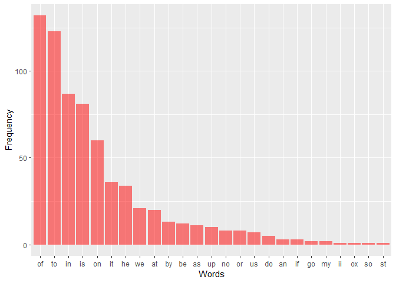

These are solutions to the exercises found at:
<https://www.r-exercises.com/2018/02/19/regular-expressions-fundamentals-exercises>

I have used the stringr library to solve these exercises

### 3.1

    data("islands")

    answer.3.1 = str_which(names(islands), "[c,C]")
    islands[answer.3.1]

    ##          Africa      Antarctica         Celebes           Celon 
    ##           11506            5500              73              25 
    ##            Cuba         Iceland      Madagascar        Moluccas 
    ##              43              40             227              29 
    ##   North America Prince of Wales   South America       Vancouver 
    ##            9390              13            6795              12 
    ##        Victoria 
    ##              82

### 3.2

    dat = "Sam goes to school. Sam comes home and studies. Sam is a good boy."

    sentences.3.2 = str_split(dat, "\\.[:blank:]", n=Inf, simplify=TRUE)
    answer.3.2 = str_which(sentences.3.2, "boy")
    sentences.3.2[answer.3.2]

    ## [1] "Sam is a good boy."

### 3.3

    dat = "A favorite copy set by English teachers, for their pupils, is the following sentence. This is because it contains every letter of the alphabet: ‘A quick brown fox jumps over the lazy dog.’"

    sentence.3.3 = str_extract(dat, "‘[^’]*’")
    answer.3.3 = str_sub(sentence.3.3, start=2L, end=-2L)
    answer.3.3

    ## [1] "A quick brown fox jumps over the lazy dog."

### 3.4

    data("sentences")

    index.3.4 = str_which(sentences, "\\s[:upper:]")
    answer.3.4 = sentences[index.3.4]
    answer.3.4

    ##  [1] "The Navy attacked the big task force."         
    ##  [2] "The term ended in late June that year."        
    ##  [3] "The wreck occurred by the bank on Main Street."
    ##  [4] "The map had an X that meant nothing."          
    ##  [5] "The rush for funds reached its peak Tuesday."  
    ##  [6] "Pink clouds floated JTith the breeze."         
    ##  [7] "Next Tuesday we must vote."                    
    ##  [8] "The cone costs five cents on Mondays."         
    ##  [9] "He takes the oath of office each March."       
    ## [10] "The beetle droned in the hot June sun."        
    ## [11] "Next Sunday is the twelfth of the month."      
    ## [12] "The rarest spice comes from the far East."     
    ## [13] "A smatter of French is worse than none."

### 3.5

    dat = c("www.dogman.com", "http://rotterdam.com", "https://facebook.com", 
      "httpx://sims.com")

    index.3.5 = str_which(dat, "^http:|^https:")
    answer.3.5 = dat[index.3.5]
    answer.3.5

    ## [1] "http://rotterdam.com" "https://facebook.com"

### 3.6

    dat = "“Gilroy Plant Place 777 Morello Ave.”"

    answer.3.6 = str_extract(dat, "\\s[:digit:][^\\.]*\\.")
    answer.3.6 = str_sub(answer.3.6, start=2L, end=-2L)
    answer.3.6

    ## [1] "777 Morello Ave"

### 3.7

    dat = "a2c if3 clean 001mn10 string asw21"
    words.3.7 = str_split(dat, "\\s", n=Inf, simplify = TRUE)
    index.3.7 = str_detect(words.3.7, "[:digit:]")
    answer.3.7 = words.3.7[index.3.7!=TRUE]
    answer.3.7

    ## [1] "clean"  "string"

### 3.8

    stri = c("AT0ACH10000700100dymax.1-1-1993.31-12-2003",
             "AT0ILL10000700500dymax.1-1-1990.31-12-2011", 
             "AT0PIL10000700500dymax.1-1-1992.31-12-2011",
             "AT0SON10000700100dymax.1-1-1990.31-12-2011",
             "AT0STO10000700100dymax.1-1-1992.31-12-2006",  
             "AT0VOR10000700500dymax.1-1-1991.31-12-2011",
             "AT110020000700100dymax.1-1-1993.31-12-2008",
             "AT2HE190000700100dymax.1-1-1993.31-12-2000", 
             "AT2KA110000700500dymax.1-1-1991.31-12-2010", 
             "AT2KA410000700500dymax.1-1-1991.31-12-2011")

    from.year = str_extract(stri, "1-1-[:digit:]{4}") %>% str_sub(start=5L, end=-1L)
    to.year = str_extract(stri, "31-12-[:digit:]{4}") %>% str_sub(start=7L, end=-1L)

    data.frame.3.8 = cbind.data.frame(from.year, to.year)

    answer.3.8 = str_glue_data(data.frame.3.8, "from {from.year} to {to.year}")
    answer.3.8

    ## from 1993 to 2003
    ## from 1990 to 2011
    ## from 1992 to 2011
    ## from 1990 to 2011
    ## from 1992 to 2006
    ## from 1991 to 2011
    ## from 1993 to 2008
    ## from 1993 to 2000
    ## from 1991 to 2010
    ## from 1991 to 2011

### 3.9

    dat = "I think, sometimes, that my use of commas, and, occasionally, exclamation marks, can be excessive. Whenever I add a word or expression, not necessary, to the sentence, just like I did with the “not necessary” and like I am doing right now, I always include these words, well maybe not always, usually include these inserts between commas; so, basically, I enjoy writing long sentences, joined with lots of commas and, frequently, semi-colons and, often, colons (and have been rather prone to using brackets, as well)."

    answer.3.9 = str_replace_all(dat, "[^[:alpha:]]", " ")
    answer.3.9

    ## [1] "I think  sometimes  that my use of commas  and  occasionally  exclamation marks  can be excessive  Whenever I add a word or expression  not necessary  to the sentence  just like I did with the  not necessary  and like I am doing right now  I always include these words  well maybe not always  usually include these inserts between commas  so  basically  I enjoy writing long sentences  joined with lots of commas and  frequently  semi colons and  often  colons  and have been rather prone to using brackets  as well  "

### 3.10

    data("sentences")

    two.char.words = str_c(sentences, sep=" ", collapse=" ") %>% str_to_lower(locale = "en") %>% str_replace_all("[:punct:]", "") %>% str_split("\\s", n=Inf, simplify=TRUE) %>% .[str_length(.) == 2] %>% table(.) %>% as.data.frame(stringsAsFactors = FALSE) %>% `colnames<-`(c("Words", "Frequency"))

    two.char.words %>% ggplot(aes(x= reorder(Words, -Frequency), y= Frequency))+ geom_col(fill="Red", alpha=0.5)+ xlab("Words")

