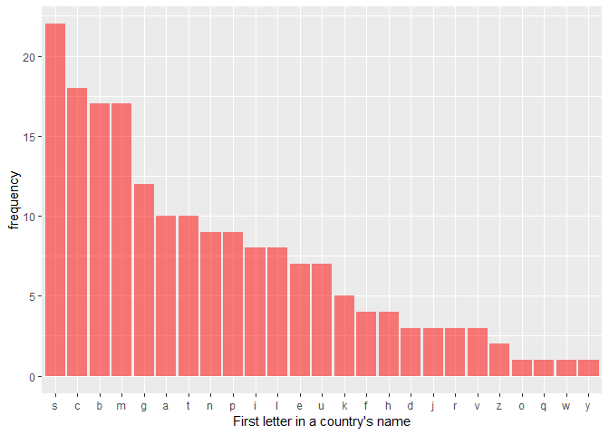
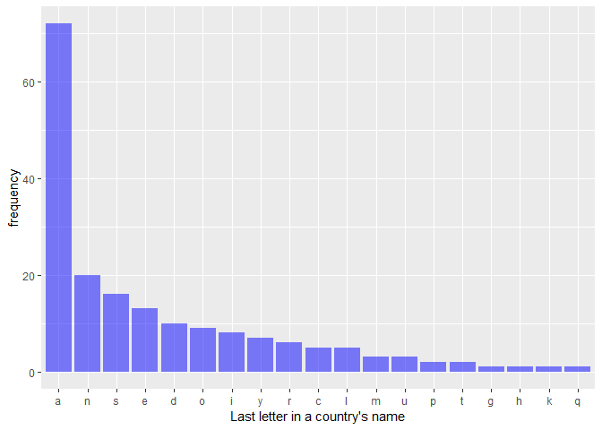
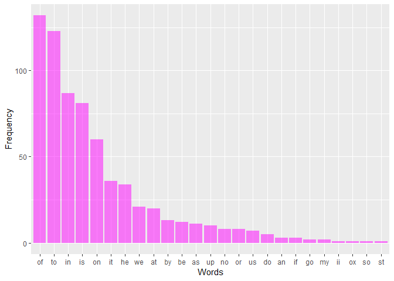

These are solutions to the exercises found at:
<https://www.r-exercises.com/2018/01/22/stringr-basic-functions-exercises/>.
I have used the stringr library to solve these exercises

### 7.1

    data("gapminder")

    country = gapminder$country %>% 
      unique() %>% 
      as.vector(mode="character")

    continent = country %>% 
      match(., gapminder$country) %>% 
      gapminder$continent[.] %>% 
      as.vector(mode="character")

    df = cbind.data.frame(country, continent)

### 7.2

    df$country %>% str_length() %>% mean()

    ## [1] 8.567568

### 7.3

    str_sub(df$country, 1L, 1L) %>% 
      str_to_lower() %>% 
      table() %>% 
      as.data.frame(stringsAsfactors = FALSE) %>% 
      `colnames<-`(c("first.letter", "frequency")) %>% 
      ggplot(aes(reorder(first.letter, -frequency), frequency))+ geom_col(fill="red", alpha=0.5)+ xlab("First letter in a country's name")

    str_remove_all(df$country, "[:punct:]") %>% 
      str_sub(-1L) %>% 
      str_to_lower() %>% 
      table() %>% 
      as.data.frame(stringsAsfactors = FALSE) %>% 
      `colnames<-`(c("last.letter", "frequency")) %>% 
      ggplot(aes(reorder(last.letter, -frequency), frequency))+ geom_col(fill="blue", alpha=0.5)+xlab("Last letter in a country's name")

### 7.4

    str_subset(df$country, "\\sand\\s")

    ## [1] "Antigua and Barbuda"            "Bosnia and Herzegovina"        
    ## [3] "St. Vincent and the Grenadines" "Trinidad and Tobago"           
    ## [5] "West Bank and Gaza"

### 7.5

    df$country = str_remove_all(df$country, "[\\,\\.]")

### 7.6

    str_c("mouse likes cat ",  str_dup("very ", 1:3), "much")

    ## [1] "mouse likes cat very much"          
    ## [2] "mouse likes cat very very much"     
    ## [3] "mouse likes cat very very very much"

    ## The question is incorrectly framed. The desired answer required in the question misses the third "very".

### 7.7

    str_trunc(df$country, 12L, side="right", ellipsis=".")

    ##   [1] "Albania"      "Algeria"      "Angola"       "Antigua and."
    ##   [5] "Argentina"    "Armenia"      "Aruba"        "Australia"   
    ##   [9] "Austria"      "Azerbaijan"   "Bahamas"      "Bahrain"     
    ##  [13] "Bangladesh"   "Barbados"     "Belarus"      "Belgium"     
    ##  [17] "Belize"       "Benin"        "Bhutan"       "Bolivia"     
    ##  [21] "Bosnia and ." "Botswana"     "Brazil"       "Brunei"      
    ##  [25] "Bulgaria"     "Burkina Faso" "Burundi"      "Cambodia"    
    ##  [29] "Cameroon"     "Canada"       "Cape Verde"   "Central Afr."
    ##  [33] "Chad"         "Chile"        "China"        "Colombia"    
    ##  [37] "Comoros"      "Congo Dem R." "Congo Rep"    "Costa Rica"  
    ##  [41] "Cote d'Ivoi." "Croatia"      "Cuba"         "Cyprus"      
    ##  [45] "Czech Repub." "Denmark"      "Djibouti"     "Dominican R."
    ##  [49] "Ecuador"      "Egypt"        "El Salvador"  "Equatorial ."
    ##  [53] "Eritrea"      "Estonia"      "Ethiopia"     "Fiji"        
    ##  [57] "Finland"      "France"       "French Poly." "Gabon"       
    ##  [61] "Gambia"       "Georgia"      "Germany"      "Ghana"       
    ##  [65] "Greece"       "Greenland"    "Grenada"      "Guatemala"   
    ##  [69] "Guinea"       "Guinea-Biss." "Guyana"       "Haiti"       
    ##  [73] "Honduras"     "Hong Kong C." "Hungary"      "Iceland"     
    ##  [77] "India"        "Indonesia"    "Iran"         "Iraq"        
    ##  [81] "Ireland"      "Israel"       "Italy"        "Jamaica"     
    ##  [85] "Japan"        "Jordan"       "Kazakhstan"   "Kenya"       
    ##  [89] "Kiribati"     "South Korea"  "Kuwait"       "Kyrgyz Repu."
    ##  [93] "Lao"          "Latvia"       "Lebanon"      "Lesotho"     
    ##  [97] "Liberia"      "Libya"        "Lithuania"    "Luxembourg"  
    ## [101] "Macao China"  "Macedonia F." "Madagascar"   "Malawi"      
    ## [105] "Malaysia"     "Maldives"     "Mali"         "Malta"       
    ## [109] "Mauritania"   "Mauritius"    "Mexico"       "Micronesia ."
    ## [113] "Moldova"      "Mongolia"     "Montenegro"   "Morocco"     
    ## [117] "Mozambique"   "Namibia"      "Nepal"        "Netherlands" 
    ## [121] "New Caledon." "New Zealand"  "Nicaragua"    "Niger"       
    ## [125] "Nigeria"      "Norway"       "Oman"         "Pakistan"    
    ## [129] "Panama"       "Papua New G." "Paraguay"     "Peru"        
    ## [133] "Philippines"  "Poland"       "Portugal"     "Puerto Rico" 
    ## [137] "Qatar"        "Romania"      "Russia"       "Rwanda"      
    ## [141] "St Lucia"     "St Vincent ." "Samoa"        "Saudi Arabia"
    ## [145] "Senegal"      "Serbia"       "Seychelles"   "Sierra Leone"
    ## [149] "Singapore"    "Slovak Repu." "Slovenia"     "Solomon Isl."
    ## [153] "South Africa" "Spain"        "Sri Lanka"    "Sudan"       
    ## [157] "Suriname"     "Swaziland"    "Sweden"       "Switzerland" 
    ## [161] "Syria"        "Tajikistan"   "Tanzania"     "Thailand"    
    ## [165] "Timor-Leste"  "Togo"         "Tonga"        "Trinidad an."
    ## [169] "Tunisia"      "Turkey"       "Turkmenistan" "Uganda"      
    ## [173] "Ukraine"      "United Arab." "United King." "United Stat."
    ## [177] "Uruguay"      "Uzbekistan"   "Vanuatu"      "Venezuela"   
    ## [181] "West Bank a." "Vietnam"      "Yemen"        "Zambia"      
    ## [185] "Zimbabwe"

    str_sub(df$country, 1L, end=ifelse(str_length(df$country)>12L, -(str_length(df$country)-10), -1L)) %>% str_c(.,".")

    ##   [1] "Albania."      "Algeria."      "Angola."       "Antigua and." 
    ##   [5] "Argentina."    "Armenia."      "Aruba."        "Australia."   
    ##   [9] "Austria."      "Azerbaijan."   "Bahamas."      "Bahrain."     
    ##  [13] "Bangladesh."   "Barbados."     "Belarus."      "Belgium."     
    ##  [17] "Belize."       "Benin."        "Bhutan."       "Bolivia."     
    ##  [21] "Bosnia and ."  "Botswana."     "Brazil."       "Brunei."      
    ##  [25] "Bulgaria."     "Burkina Faso." "Burundi."      "Cambodia."    
    ##  [29] "Cameroon."     "Canada."       "Cape Verde."   "Central Afr." 
    ##  [33] "Chad."         "Chile."        "China."        "Colombia."    
    ##  [37] "Comoros."      "Congo Dem R."  "Congo Rep."    "Costa Rica."  
    ##  [41] "Cote d'Ivoi."  "Croatia."      "Cuba."         "Cyprus."      
    ##  [45] "Czech Repub."  "Denmark."      "Djibouti."     "Dominican R." 
    ##  [49] "Ecuador."      "Egypt."        "El Salvador."  "Equatorial ." 
    ##  [53] "Eritrea."      "Estonia."      "Ethiopia."     "Fiji."        
    ##  [57] "Finland."      "France."       "French Poly."  "Gabon."       
    ##  [61] "Gambia."       "Georgia."      "Germany."      "Ghana."       
    ##  [65] "Greece."       "Greenland."    "Grenada."      "Guatemala."   
    ##  [69] "Guinea."       "Guinea-Biss."  "Guyana."       "Haiti."       
    ##  [73] "Honduras."     "Hong Kong C."  "Hungary."      "Iceland."     
    ##  [77] "India."        "Indonesia."    "Iran."         "Iraq."        
    ##  [81] "Ireland."      "Israel."       "Italy."        "Jamaica."     
    ##  [85] "Japan."        "Jordan."       "Kazakhstan."   "Kenya."       
    ##  [89] "Kiribati."     "South Korea."  "Kuwait."       "Kyrgyz Repu." 
    ##  [93] "Lao."          "Latvia."       "Lebanon."      "Lesotho."     
    ##  [97] "Liberia."      "Libya."        "Lithuania."    "Luxembourg."  
    ## [101] "Macao China."  "Macedonia F."  "Madagascar."   "Malawi."      
    ## [105] "Malaysia."     "Maldives."     "Mali."         "Malta."       
    ## [109] "Mauritania."   "Mauritius."    "Mexico."       "Micronesia ." 
    ## [113] "Moldova."      "Mongolia."     "Montenegro."   "Morocco."     
    ## [117] "Mozambique."   "Namibia."      "Nepal."        "Netherlands." 
    ## [121] "New Caledon."  "New Zealand."  "Nicaragua."    "Niger."       
    ## [125] "Nigeria."      "Norway."       "Oman."         "Pakistan."    
    ## [129] "Panama."       "Papua New G."  "Paraguay."     "Peru."        
    ## [133] "Philippines."  "Poland."       "Portugal."     "Puerto Rico." 
    ## [137] "Qatar."        "Romania."      "Russia."       "Rwanda."      
    ## [141] "St Lucia."     "St Vincent ."  "Samoa."        "Saudi Arabia."
    ## [145] "Senegal."      "Serbia."       "Seychelles."   "Sierra Leone."
    ## [149] "Singapore."    "Slovak Repu."  "Slovenia."     "Solomon Isl." 
    ## [153] "South Africa." "Spain."        "Sri Lanka."    "Sudan."       
    ## [157] "Suriname."     "Swaziland."    "Sweden."       "Switzerland." 
    ## [161] "Syria."        "Tajikistan."   "Tanzania."     "Thailand."    
    ## [165] "Timor-Leste."  "Togo."         "Tonga."        "Trinidad an." 
    ## [169] "Tunisia."      "Turkey."       "Turkmenistan." "Uganda."      
    ## [173] "Ukraine."      "United Arab."  "United King."  "United Stat." 
    ## [177] "Uruguay."      "Uzbekistan."   "Vanuatu."      "Venezuela."   
    ## [181] "West Bank a."  "Vietnam."      "Yemen."        "Zambia."      
    ## [185] "Zimbabwe."

### 7.8

    data("sentences")

    sentences %>% 
      str_remove_all("[:punct:]") %>% 
      str_c(sep=" ", collapse=" ") %>% 
      str_split(pattern="\\s", n=Inf, simplify=TRUE) %>% 
      str_to_lower() %>%
      .[str_length(.)==2] %>%
      table() %>% 
      as.data.frame(stringsAsfactors=FALSE) %>% 
      `colnames<-`(c("Words", "Frequency")) %>% 
      ggplot(aes(reorder(Words, -Frequency), Frequency))+ geom_col(fill="magenta", alpha=0.5)+ xlab("Words")

### 7.9

    dat = df$country %>% 
      str_remove_all(pattern="[:punct:]") %>%
      str_to_lower() %>%
      str_remove_all("\\s") %>%
      str_c(sep="", collapse="") %>%
      str_split(pattern="", n=Inf, simplify=TRUE) %>%
      table() %>%
      as.data.frame(stringsAsfactors=FALSE) %>%
      `colnames<-`(c("letters", "frequency"))

    dat[which.max(dat$frequency),]

    ##   letters frequency
    ## 1       a       251

### 7.10

    dat = str_count(df$country, "[A,a]")

    df[which.max(dat),]

    ##               country continent
    ## 4 Antigua and Barbuda  Americas

The answer in the solution key is incorrect because it does not take
into account both the cases of the letter.
