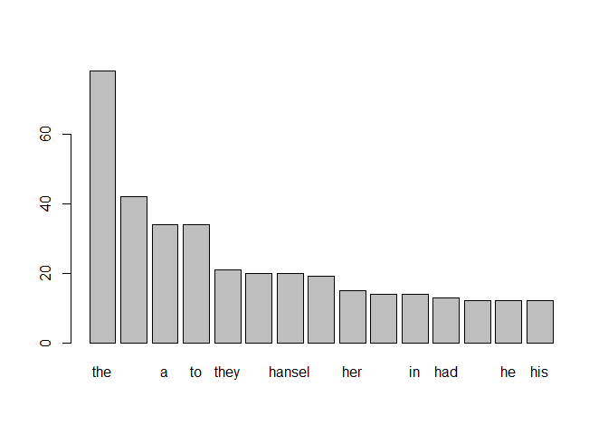

These are solutions to the exercises found at:
<https://www.r-exercises.com/2017/11/27/text-data-wrangling-exercises/>.
I have used the stringr library to solve these exercises

### 9.1

    url.9.1 = "http://textfiles.com/stories/hansgrtl.txt"

    hs = readLines(url.9.1)

### 9.2

    hs.9.2 = hs %>% str_split("\\s") %>% unlist

### 9.3

    hs.9.3 = hs.9.2 %>% str_to_lower()

### 9.4

    hs.9.4 = hs.9.3 %>% str_remove_all("[:punct:]") %>% .[.!=""]

9.5
---

    hs.9.4 %>% table() %>% sort(decreasing=TRUE) %>%
      .[1:15] %>% barplot()

### 9.6

    hs.9.4 %>% .[!. %in% stopwords("en")] %>% 
      table() %>% sort(decreasing=TRUE) %>% 
      .[1:15] %>% barplot() 

### 9.7

    hs.9.7 = hs.9.4[hs.9.4 != "=="] 

    hs.9.7 %>% .[!. %in% stopwords("en")] %>% 
      stemDocument(language="english") %>% table() %>% sort(decreasing=TRUE) %>% 
      .[1:15] %>% barplot()

### 9.8

    hs.9.8 = hs[3:length(hs)]

    hs.9.8.a = str_c(hs.9.8[1:26], sep=" ", collapse=" ") %>% str_squish()
    hs.9.8.b = str_c(hs.9.8[27:52], sep=" ", collapse=" ") %>% str_squish()
    hs.9.8.c = str_c(hs.9.8[53:78], sep=" ", collapse=" ") %>% str_squish()
    hs.9.8.d = str_c(hs.9.8[79:104], sep=" ", collapse=" ") %>% str_squish()

    hs.9.8 = c(hs.9.8.a, hs.9.8.b, hs.9.8.c, hs.9.8.d)

### 9.9

    hs.9.9 = Corpus(VectorSource(hs.9.8)) 
    hs.9.9 = tm_map(hs.9.9, tolower)

    ## Warning in tm_map.SimpleCorpus(hs.9.9, tolower): transformation drops
    ## documents

    hs.9.9 = tm_map(hs.9.9, removeWords, stopwords("en"))

    ## Warning in tm_map.SimpleCorpus(hs.9.9, removeWords, stopwords("en")):
    ## transformation drops documents

    hs.9.9 = tm_map(hs.9.9, removePunctuation)

    ## Warning in tm_map.SimpleCorpus(hs.9.9, removePunctuation): transformation
    ## drops documents

    hs.9.9 = tm_map(hs.9.9, stemDocument)

    ## Warning in tm_map.SimpleCorpus(hs.9.9, stemDocument): transformation drops
    ## documents

    hs.9.9[[2]][1]

    ## $content
    ## [1] "tini white pebbl gleam moonlight children found way home crept halfopen window without waken parent cold tire thank home slip bed next day stepmoth discov hansel gretel return went rage stifl anger front children lock bedroom door reproachlng husband fail carri order weak woodcutt protest torn shame fear disobey cruel wife wick stepmoth kept hansel gretel lock key day noth supper sip water hard bread night husband wife quarrel dawn came woodcutt led children forest hansel howev eaten bread walk tree left trail crumb behind mark way littl boy forgotten hungri bird live forest saw flew along behind time eaten crumb lame excus woodcutt left two children left trail like last time hansel whisper gretel consol night fell saw horror crumb gone frighten wept gretel bitter cold hungri want go home afraid look hansel tri encourag sister shiver glimps frighten shadow evil eye around dark night two children huddl togeth warmth foot larg tree"

### 9.10

    hs.9.9 %>% TermDocumentMatrix() %>% 
      as.matrix() %>% cor()

    ##           1          2          3          4
    ## 1 1.0000000 0.41247636 0.16009125 0.15121369
    ## 2 0.4124764 1.00000000 0.08874493 0.07348398
    ## 3 0.1600913 0.08874493 1.00000000 0.24007998
    ## 4 0.1512137 0.07348398 0.24007998 1.00000000
